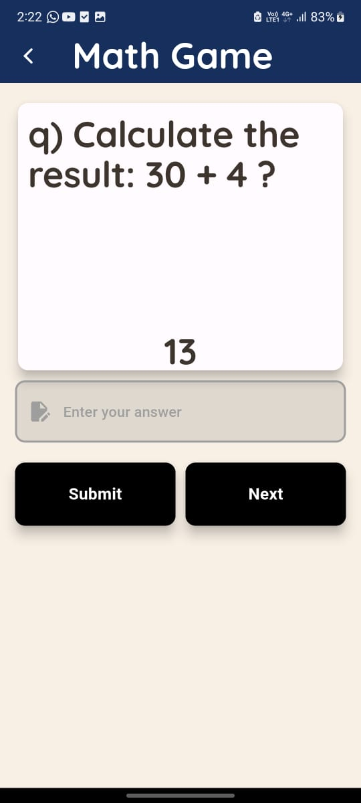

# Basic Math Quiz App

## Description
A simple Flutter quiz application that generates random mathematical questions using the four basic operators: addition, subtraction, multiplication, and division. The app provides feedback to the user based on right and wrong answers and maintains a scoreboard to track user performance.

## Screenshots



## Features
- Randomly generated math questions with basic operators (+, -, *, /)
- Instant feedback on right or wrong answers
- A scoreboard to track the user's progress
- Clean and simple UI designed using Flutter widgets

## Getting Started

### Prerequisites
Ensure you have the following tools installed:
- [Flutter](https://flutter.dev/docs/get-started/install)
- A code editor like [VS Code](https://code.visualstudio.com/) or [Android Studio](https://developer.android.com/studio)

### Installation

1. Clone this repository:
    ```bash
    git clone https://github.com/username/math-quiz-app.git
    ```

2. Navigate to the project directory:
    ```bash
    cd math-quiz-app
    ```

3. Install dependencies:
    ```bash
    flutter pub get
    ```

4. Run the app on a connected device or emulator:
    ```bash
    flutter run
    ```

## Folder Structure

```bash
lib/
├── blocs/                   #Buisiness logic components for state management
├── data/                    #contains models and repositories
├── presentation/            #screens and reusable widgets
├── resources/               #constants such as colors,themes,strings etc..
└── utils/                   #utiliy functions
